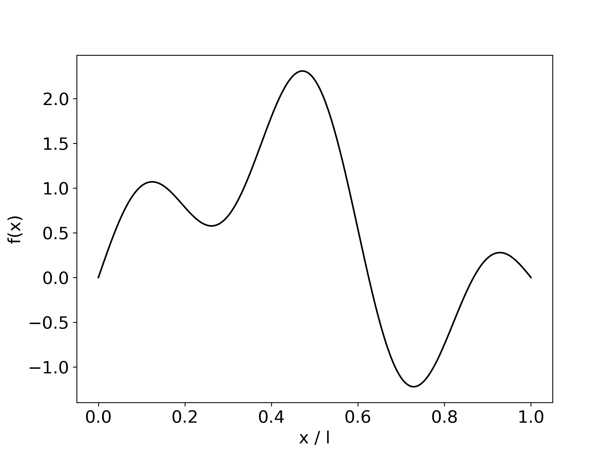
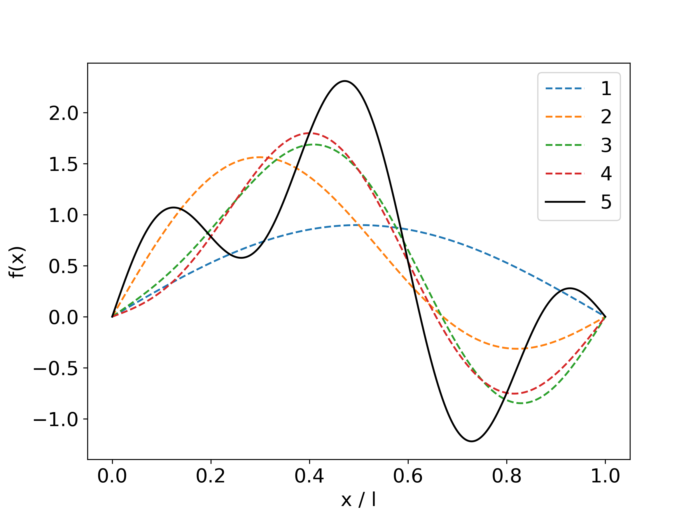
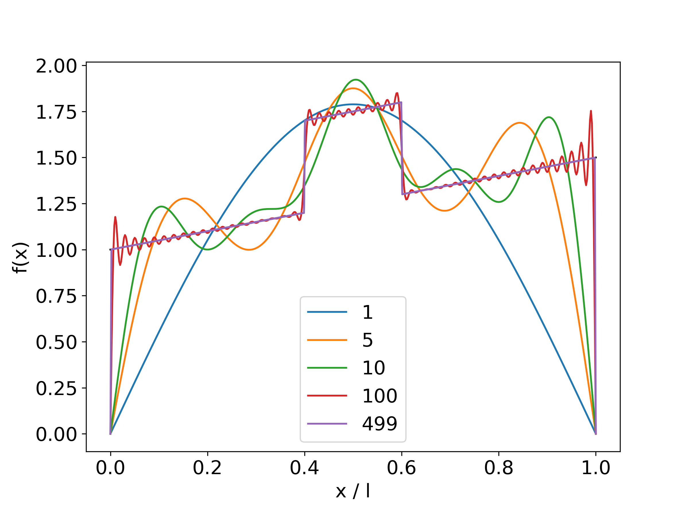
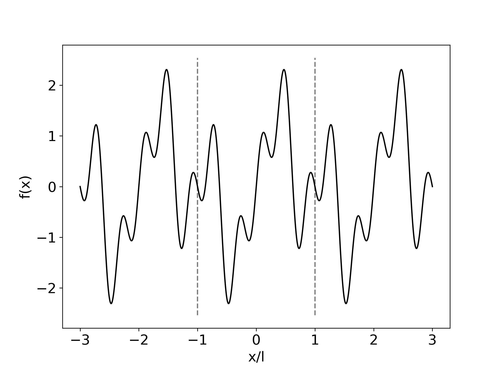
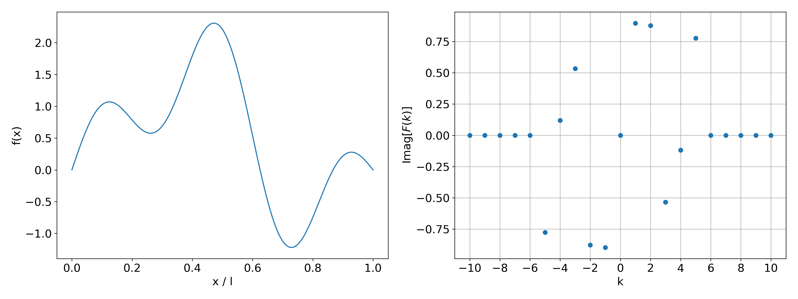
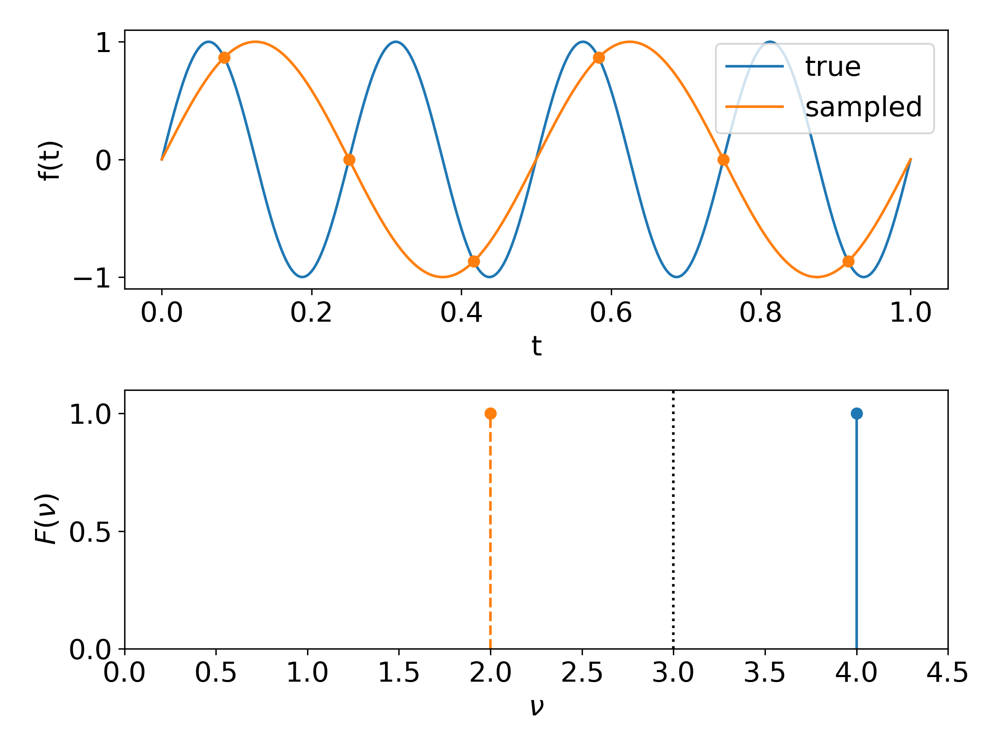
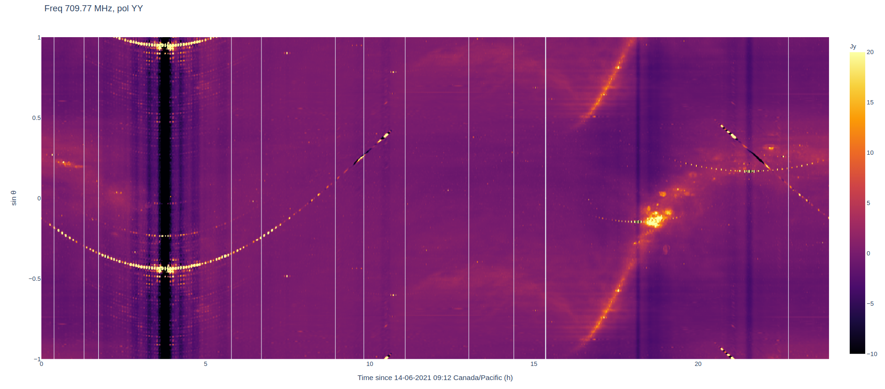

## Reading
- Chapter 24 of the python book
- Chapters 12.0-12.2 of Numerical Recipes in C

## Fourier sine series
A $\sin$ series with coefficients $a_n$ defines a function over a finite interval
$$
  f(x) = \sum_n^\infty a_n \sin\left(\frac{n \pi x}{l}\right)\text{,}
  \quad 0 < x < l \text{.}
$$
{ width=50% }

## Fourier sine series
A $\sin$ series with coefficients $a_n$ defines a function over a finite interval
$$
  f(x) = \sum_n^\infty a_n \sin\left(\frac{n \pi x}{l}\right)\text{,}
  \quad 0 < x < l \text{.}
$$
{ width=50% }

## Fourier sine series
A nice property of the $\sin$ functions is *orthogonality*:
$$
  \int_0^l dx \sin\left(\frac{n \pi x}{l}\right)
  \sin\left(\frac{m \pi x}{l}\right) = 0\text{,} \quad m \neq n\text {.}
$$

## Fourier sine series
The orthogonality property makes it easy to compute the coefficients of the series:
$$
  \int_0^ldx \sin\left(\frac{n \pi x}{l}\right) f(x)
  = \int_0^ldx \sin\left(\frac{n \pi x}{l}\right)
  \sum_m^\infty a_m \sin\left(\frac{m \pi x}{l}\right)
  = \frac{l}{2} a_n \text{.}
$$

## Fourier sine series
It can be shown that for *any* function, the sine series with coefficients
computed this way converges to that function. This is called *completeness*.
It means we can decompose any function into a sum of sines.
{ width=50% }

## Fourier Series
The properties just discussed for the sine series also apply to the cosine series.
Putting them together forms the full Fourier series
$$
  f(x) = a_0 + \sum_n^\infty a_n \cos\left(\frac{n \pi x}{l}\right)
  + \sum_n^\infty b_n \sin\left(\frac{n \pi x}{l}\right) \text{, }
  -l < x < l \text{.}
$$
These functions can be expressed compactly in complex form, using the fact that $e^{i \theta} = \cos\theta + i \sin\theta$,
$$
  f(x) = \sum_n^\infty c_n e^{i n \pi x / l}\text{, } c_n \in \mathbb{C} \text{.}
$$

## Fourier Transform
By construction, the Fourier series we defined above is periodic on an interval
of $2l$. Evaluating it outside $-l < x < l$, we get copies of the same function.

{ width=50% }

## Fourier Transform
What if we want to decompose a function that is not periodic?
We can extend the domain to be arbitrarily large:
$$
l \rightarrow \infty \text{,} \quad \frac{n}{2 l} \rightarrow k \text{,}
$$
where $k$ is the continuous limit of $n$, the "frequency" of the sine function.
The sum over $n$ becomes an integral over $k$, and the coefficients $c_n$, a
continuous function of $k$
$$
  f(x) = \int_{-\infty}^{\infty} dk~e^{2 \pi i k x} F(k) \text{.}
$$

## Fourier Transform
$F(k)$ is the Fourier transform of $f(x)$. Because it is common to take Fourier
transforms of time-series data, we often refer to $f(x)$ as being in the "time
domain" as $F(k)$ its representation in the "frequency domain". There is no
fundamental difference between the two, the inverse transform has the same form
and is lossless.
$$
  F(k) = \int_{-\infty}^{\infty} dx~e^{-2 \pi i k x} f(x) \text{,}
$$
$$
  f(x) = \int_{-\infty}^{\infty} dk~e^{2 \pi i k x} F(k) \text{.}
$$

## Fourier Transform of a Real Function
$$
\begin{aligned}
  F(-k) &= \int_{-\infty}^{\infty} dx~e^{-2 \pi i (-k) x} f(x) \\
  &= \left[\int_{-\infty}^{\infty} dx~e^{-2 \pi i k x} f^*(x)\right]^* \\
  &= \left[\int_{-\infty}^{\infty} dx~e^{-2 \pi i k x} f(x)\right]^* \\
  &= F^*(k) \text{.}
\end{aligned}
$$
The negative frequencies are redundant.

## Fourier Transform of a Real Function
$$
  F(-k) = F^*(k)
$$
{ width=100% }

## Convolution theorem
**(skipping this)**

## Sampling Theorem
A measurement is composed of discrete samples of a continuous signal, separated in time by intervals $\Delta t$.
The sampling theorem states that for a *bandlimited signal* (i.e. with power only in a finite frequency band, say $\Delta\nu$) there is a finite sampling rate beyond which *no additional information* is obtained about the underlying signal.
It is called the Nyquist rate and is twice the bandwidth:
$$
  \frac{1}{\Delta t} \geq 2 \Delta \nu \text{.}
$$
If a signal is Nyquist sampled, the underlying continuous signal can be perfectly reconstructed (in the absence of noise).

## Sampling Theorem Example
The human ear can only hear frequencies below $\sim$ 20 kHz.
A perceptible sound signal is effectively band-limited at 20 kHz.
This is why high-fidelity recordings (e.g. CD quality) are sampled around 44 kHz.
This is sufficient to reconstruct the original sound perfectly.

## Aliasing
What if the sampling rate is too low to capture the highest frequencies?
$$
  \Delta t \lt \frac{1}{2 \Delta\nu}
$$
It becomes impossible to distinguish between certain pairs of frequencies.

{ width=50% }

## Discrete Fourier Transform
A measurement is composed of discrete samples of a continuous signal.
If we have $N$ samples $f_n$, we can take their transform
$$
  F_k = \sum_n^N f_n e^{-2 \pi i n k / N}, \quad n, k \in \mathbb{Z}\text{,}
$$
and the inverse transform is
$$
  f_n = \frac{1}{N}\sum_k^N F_k e^{2 \pi i n k / N}\text{.}
$$
(the factor of $1/N$ is a normalisation convention, other choices are possible but this is a common one.)

## Discrete Fourier Transform
The DFT output is periodic with period $N$:
$$
\begin{aligned}
  F_{k+N} &= \sum_n^N f_n e^{-2 \pi i n (k + N) / N}\\
  &= \sum_n^N f_n e^{-2 \pi i n k / N} e^{-2 \pi i n}\\
  &= F_k; \quad e^{-2 \pi i n}  = 1,\ n \in \mathbb{Z}\text{.}
\end{aligned}
$$
The negative frequencies are packed in the second half of the FFT output.
With $k \in \{0, ...\ , N / 2\}$,
$$
  F_{-k} = F_{N-k} \text{.}
$$

## Discrete Fourier Transform
The previous expression was unitless.
For samples separated in time by intervals $\Delta t$, the total length of the measurement is $T = N\Delta t$.
$$
\begin{aligned}
  f_n &= \frac{1}{N}\sum_k^N F_k e^{2 \pi i n k / N} \quad n, k \in \mathbb{Z}\\
  &= \frac{1}{N}\sum_k^N F_k e^{2 \pi i (n \Delta t) k / (N \Delta t)}\\
  f(t_n) &= \frac{1}{N}\sum_k^N F_k e^{2 \pi i k t_n / T} \text{,}
\end{aligned}
$$
where $\frac{k}{T} = \nu_k$ is the frequency at which we evaluate the transform.
Note that this is (almost) exactly the Fourier series we started out with!
This is because we are once again working on a finite interval.

## Discrete Fourier Transform
The length of the measurement specifies special frequencies $\nu_k = \frac{k}{T}$ that correspond to the Fourier series on that interval.
This determines the frequency resolution of the transform:
$$
  \Delta \nu = \frac{1}{T}\text{.}
$$
To achieve a higher resolution in the frequency domain we need a longer stretch of data in the time domain (and vice versa).
Note that the largest frequency
$$
  \nu_{N/2} = \frac{1}{2\Delta t}
$$
is the Nyquist limit for the sampling rate.
Larger frequencies can be aliased.

## Example: CHIME vs CHIME/HFB
For CHIME, we collect data at a rate of 800 MHz, or every 1.25 ns.
After 2048 samples (2.56 $\mu$s) we take their Fourier transform.
This produces a frequency resolution of 1 / (2.56 $\mu$s) = 391 kHz.

The CHIME/HFB backend needs a higher frequency resolution, so they accumulate time samples by a further factor of 128 to get $\sim$ 3 kHz frequency bins at $\sim$ 0.33 ms cadence.

## Discrete Fourier Transform
With these frequencies $\nu_k = k / T$, the orthogonality and completeness properties hold, and the DFT is perfectly invertible.
However, in principle the DFT can be evaluated at any arbitrary frequency:
$$
  F(\nu) = \sum_n^N f_n e^{-2 \pi i n \Delta t \nu}\text{.}
$$
This effectively interpolates between the $\nu_k$ and is not in general invertible.

## Fast Fourier Transform
It's a clever DFT algorithm that brings the computational cost from $\mathcal{O}(N^2)$ to $\mathcal{O}(N\log N)$.

Relies on recursively dividing the data by factors of 2, so it is much more efficient given input data with a length that is a power of 2:
$$
  N = 2^n \text{.}
$$
If performance is important, you should pad your data with zeros to an optimal length (a power of 2 or something else, depending on the implementation).

## Fast Fourier Transform
Useful modules in `numpy`/`scipy`:

- `fft.fft`/`fft.ifft`: computes the FFT/inverse FFT
- `fft.rfft`/`fft.irfft`: computes the FFT/inverse FFT of real data
  - cuts computation in half by returning only positive frequencies
- `fft.fftfreq`/`fft.rfftfreq`: provides the physical frequencies, given the sampling rate
- `fft.fftshift`: reorders the `fft` output so that negative frequencies come first
- `scipy.fft.next_fast_len`: gives the nearest optimal input length

## Interferometers (?)
- CHIME doesn't image the sky, it measures Fourier modes of the sky!
- Making an image is not trivial, because we have incomplete information, aliasing.

## Aliasing in Ringmaps
A ringmap is formed by taking the Fourier transform of the visibilities.
The baseline separations are not sampled finely enough and aliasing manifests itself as multiple copies of sources near the horizons.

{ width=100% }
